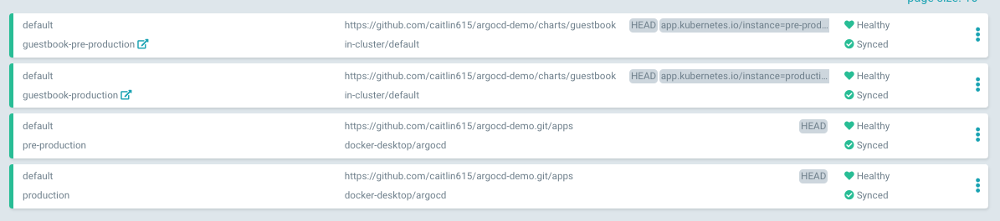

argocd-demo
---

[Argo CD](https://argoproj.github.io/argo-cd/) is a declarative, GitOps continuous delivery tool for Kubernetes.

This project is a POC to show the full pipeline of a deployment with multiple "environments"
from within a Docker for Mac Kubernetes cluster, requiring no external resources.

**If you would like to try out the full GitOps feature set of Argo CD,
be sure to fork this repo first so you can push your own commits to trigger changes**.

Fork this repo here: https://github.com/caitlin615/argocd-demo/fork.

You'll then have to update `spec.source.repoURL` in [apps/values.yaml](./apps/values.yaml) to match your forked repo URL for any of this to work.

# Requirements
- [Docker Desktop on Mac](https://docs.docker.com/docker-for-mac/install/)
- [Kubernetes cluster enabled](https://docs.docker.com/docker-for-mac/#kubernetes)
- [Argo CLI](https://argoproj.github.io/argo-cd/getting_started/#2-download-argo-cd-cli)
  - `brew tap argoproj/tap && brew install argoproj/tap/argocd`

# Setup
## Install Argo CD
Install Argo CD
```bash
make init
```
This will expose Argo CD at `http://localhost:8080` and output the default password for the `admin` user.
Change the password in the UI, or with `argocd login localhost:8080`, then `argocd account update-password`.

## Add your cluster to Argo CD
This isn't super necessary, but allows us to pretend we're running argo on a different
cluster from where we're deploying our applications.
(you can also do this via the web UI)

```bash
# List available clusters
argocd cluster add
# To add docker-deskop cluster
argocd cluster add docker-desktop
```

# Deploy "Parent" Applications
For the purposes of this demo, we will be using the [**app of apps** pattern](https://argoproj.github.io/argo-cd/operator-manual/cluster-bootstrapping/). This means we create an app
that will create all of our apps.


There are two parent applications that represent each "environment":
* `production`
* `pre-production`

## Deploying
```bash
make deploy
```

### Force a sync
Now that you've deployed both apps, along with their child apps, they will not automatically sync. Force a sync to get the kubernetes resources deployed.

```bash
make sync
```

You will now see something like this at http://localhost:8080.
The top two are the guestbook applications, and the bottom two are the parent applications.



# Access Guestbook

Access each guestbook here:
* http://localhost:8081 (`production`)
* http://localhoust:8082 (`pre-production`)

# Playing with GitOps
Now's when the real fun happens!

Make some changes to the guestbook helm chart in `charts/guestbook`,
commit them, and push them to `master` (make sure you've forked this repo!). Within three minutes (or after running `make sync`), your changes will deploy!

Try changing `image.tag` to `v2` in `charts/guestbook/values-production.yml`! Update `replicaCount` and watch the magic happen!

# Not included
Not included in this POC are:
* RBAC
* TLS
* User/Project management
* Metrics
* [Secrets](https://argoproj.github.io/argo-cd/operator-manual/secret-management/)
* [Git Webhook](https://argoproj.github.io/argo-cd/operator-manual/webhook/)
* CI
* Initialization of `argocd` via helm
* HA/DR
